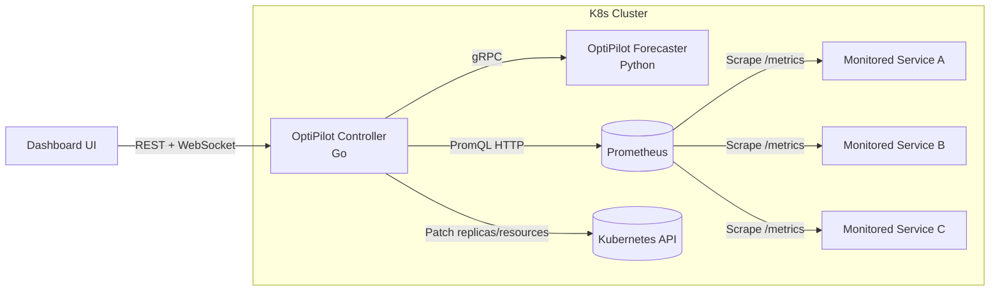

# ============================================================================
#  OptiPilot
#  Machine Learning-Driven Predictive Autoscaling for Kubernetes HTTP Services
# ============================================================================

OptiPilot is a Kubernetes-native predictive autoscaling system that forecasts traffic and scales services **before** load spikes degrade performance.

## Features

- Contract-first architecture with shared gRPC API (`proto/optipilot/v1/prediction.proto`).
- Go controller with service discovery, Prometheus collection, decisioning, and safety controls.
- Python forecaster with LightGBM quantile models (p50/p90), training, recalibration, and drift detection.
- Shadow / recommend / autonomous operating modes.
- Global + per-service kill switches and conservative fallback controls.
- Audit trail of simulated and executed scaling decisions.
- Built-in dashboard backend in controller (REST + WebSocket events).
- Helm chart packaging for cluster deployment.
- Vegeta load-test scenarios for ramp, spike, periodic, and realistic mixed traffic.
- End-to-end demo workflow for Kind + Prometheus + OptiPilot.

## Quick start (local dev)

```bash
git clone https://github.com/abi-0611/optipilot.git
cd optipilot && docker compose up --build
(cd forecaster && uv sync && uv run forecaster)
(cd controller && go run . -config optipilot.yaml)
curl http://localhost:8080/api/system/status
```

## Architecture



## Dashboard screenshots

Screenshots are intentionally omitted in this revision; use the live walkthrough in `docs/DEMO.md`.

## Documentation

- [Architecture deep dive](docs/ARCHITECTURE.md)
- [API reference (REST, gRPC, WebSocket)](docs/API.md)
- [Operations guide](docs/OPERATIONS.md)
- [ML pipeline deep dive](docs/ML.md)
- [Contributing guide](docs/CONTRIBUTING.md)
- [End-to-end demo walkthrough](docs/DEMO.md)
- [Changelog](CHANGELOG.md)

## Tech stack

- **Controller:** Go, `slog`, `client-go`, SQLite (`modernc.org/sqlite`)
- **Forecaster:** Python, `grpc.aio`, LightGBM, APScheduler, SQLite
- **Contract:** Protocol Buffers + gRPC
- **Dashboard backend:** Go `net/http` + Gorilla WebSocket
- **Load testing:** Vegeta
- **Packaging:** Helm

## License

[MIT](LICENSE)

