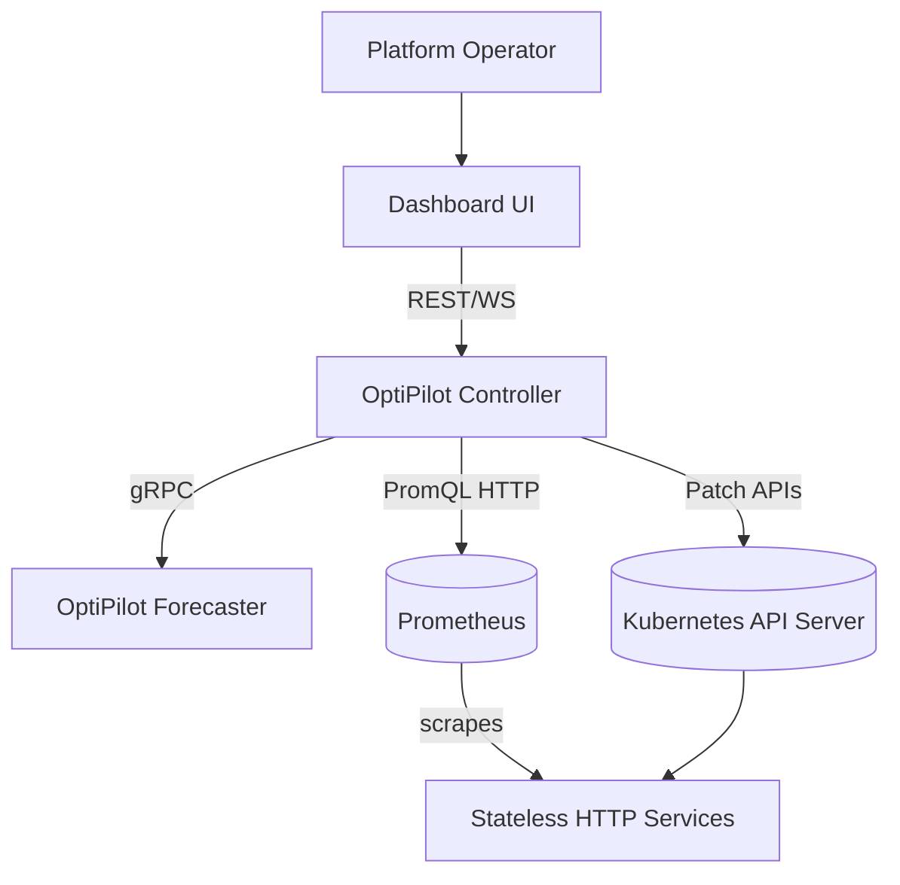
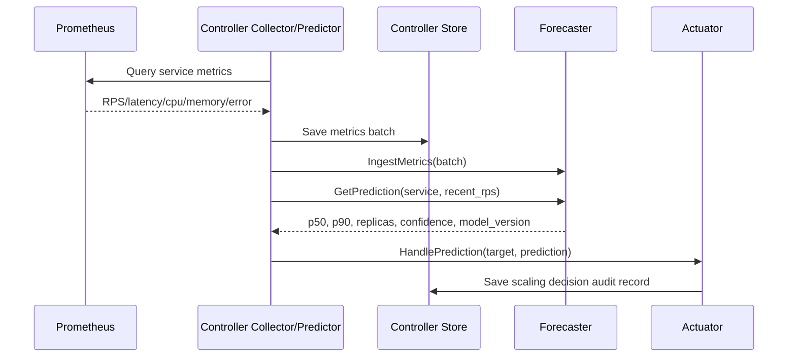
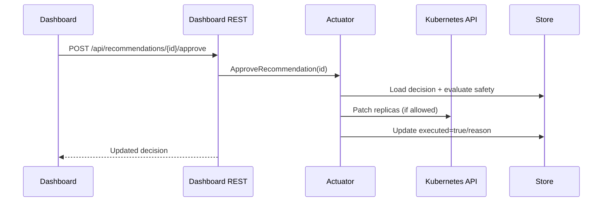
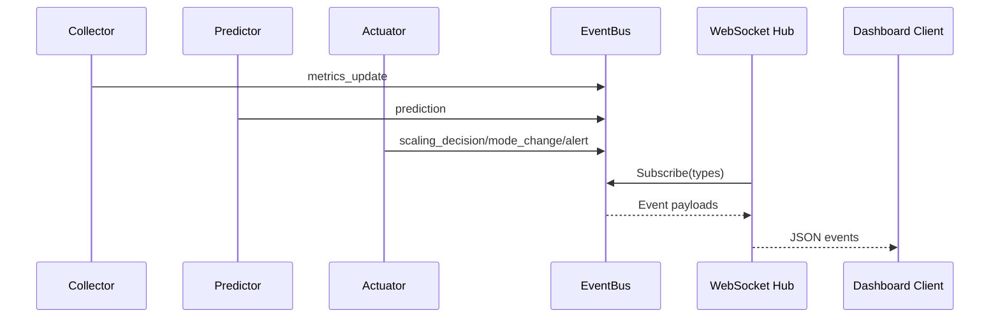
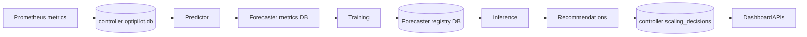
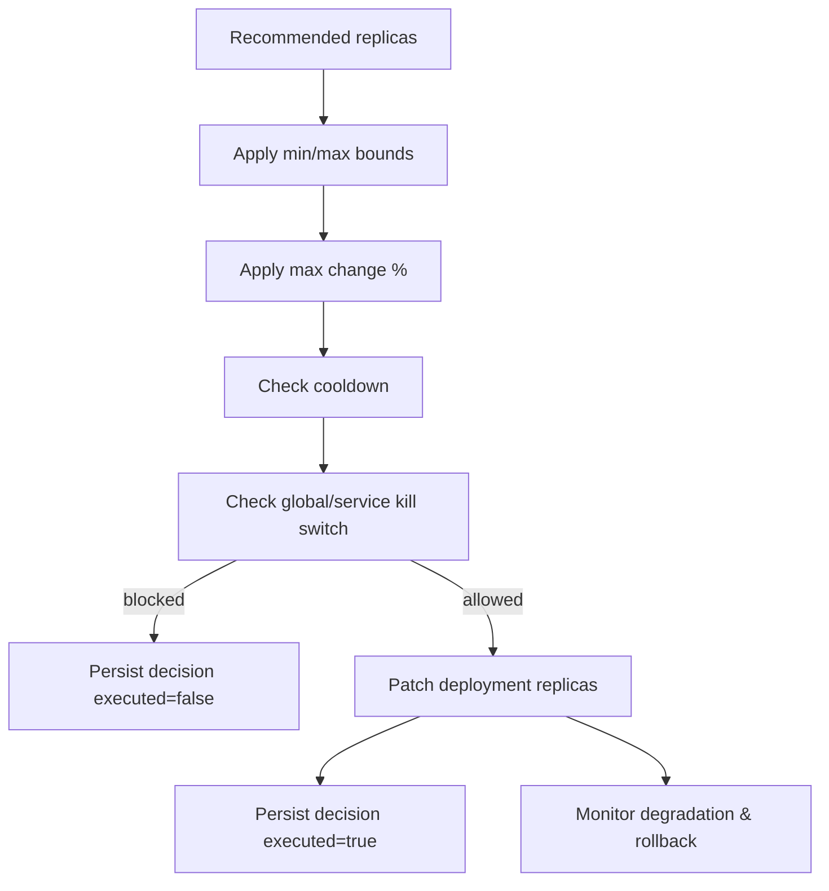

# OptiPilot Architecture

This document describes OptiPilot’s runtime architecture, component responsibilities, and design rationale.

## 1. System context

## 2. Component responsibilities

## Controller (Go)

- Loads config, initializes SQLite store, and manages lifecycle/shutdown.
- Discovers target services (static or Kubernetes informer mode).
- Collects service metrics from Prometheus on a fixed interval.
- Runs predictor loop:
  - pushes metrics to forecaster (`IngestMetrics`)
  - requests forecasts (`GetPrediction`)
  - passes recommendations to actuator.
- Runs actuator + safety logic:
  - mode handling (shadow/recommend/autonomous)
  - cooldown, bounds, rate limiting, kill switches
  - optional vertical patching and rollback monitoring.
- Serves dashboard backend:
  - REST APIs for history/control
  - WebSocket event stream.

## Forecaster (Python)

- Stores ingested metrics.
- Trains per-service LightGBM p50/p90 models.
- Serves inference results with confidence and mode signal.
- Schedules recalibration/retrain/drift detection jobs.
- Maintains model registry and promotion status.

## 3. Runtime interactions

## 3.1 Metrics to prediction flow

## 3.2 Recommend mode approval path

## 3.3 Event streaming

## 4. Data flow

## 5. Safety model

## 6. Technology choices and rationale

- **Go controller:** strong concurrency model for periodic loops and Kubernetes integration.
- **Python forecaster:** richer ML ecosystem (LightGBM, pandas, numpy).
- **gRPC + protobuf:** typed, language-agnostic boundary between control plane and ML plane.
- **SQLite:** lightweight persistence for local/dev and demo environments.
- **Prometheus integration:** standard source of service telemetry in Kubernetes.
- **Event-driven dashboard backend:** low-latency operator visibility via WebSockets.

## 7. Current constraints

- v1 targets stateless HTTP services on Kubernetes.
- Some UI wiring is still being aligned with latest backend routes.
- Production-grade HA hardening (multi-instance leader election, external DB, etc.) is out of current scope.

